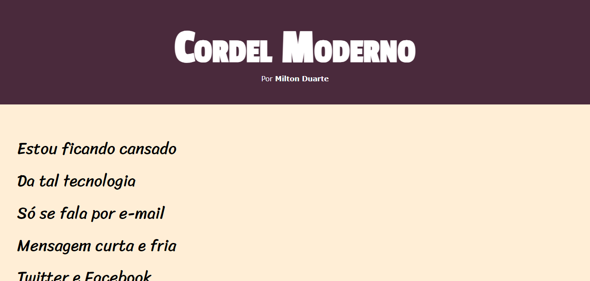

# projeto-cordel
Projeto realizado no curso de HTML5 e CSS3 da plataforma Curso em Vídeo com o professor Gustavo Guanabara

Para acessar o projeto <a href="https://mariaeduardateixeira.github.io/projeto-cordel/">Clique aqui</a>

<h1 align="center"> Cordel Moderno </h1>
<h3 align="center"> Por Milton Duarte </h3>

Projeto desenvolvido no curso de HTML5 e CSS3 da plataforma Curso em Vídeo com o professor Gustavo Guanabara.  

  <a href="#-tecnologias">Tecnologias</a>&nbsp;&nbsp;&nbsp;|&nbsp;&nbsp;&nbsp;
  <a href="#-projeto">Projeto</a>

 

  

## 🚀Tecnologias

Esse projeto foi desenvolvido com as seguintes tecnologias:

-> HTML e CSS
 
-> Git e Github

## 💻Projeto

- [Visite o projeto online](https://mariaeduardateixeira.github.io/projeto-cordel/)

